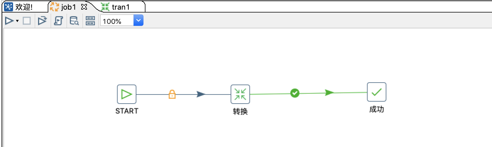
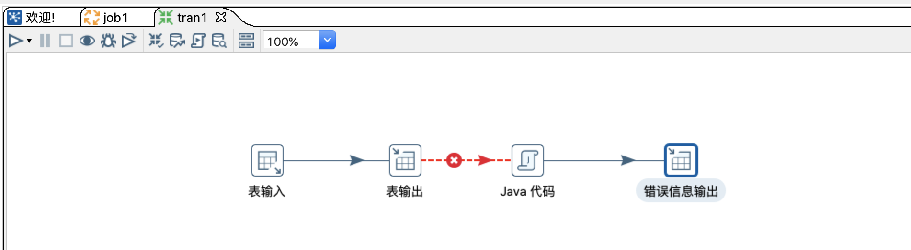
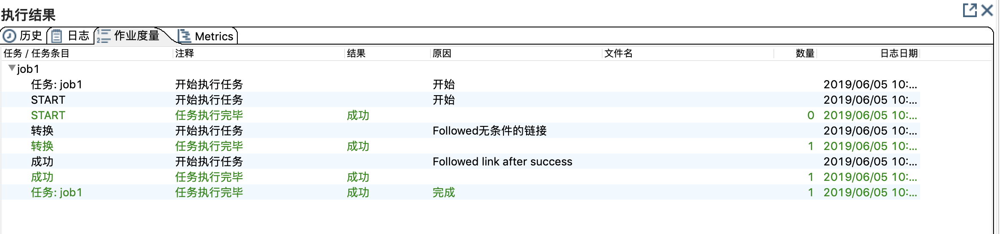

# 快速开始

> 此处简单介绍一个Kettle流程能完成的工作，对于详细的操作，将会再其他章节介绍。如果你对Kettle对基本概念不感兴趣或者你已经对Kettle比较熟悉，
现在仅需要参考Kettle中各个步骤的使用，可以直接跳到[转换步骤](/transformationStep.md).

### 下载
>注意：kettle是免安装的，所以下载解压即可以使用，以下为下载解压的过程。需要注意的是，kettle使用Java开发，所以需要提前安装好Java环境，
这里不会去说明Java环境的安装方法，不熟悉的朋友可以自行百度或谷歌。

- 可以通过[官网下载地址](https://sourceforge.net/projects/pentaho/files/Data%20Integration/) 下载需要的版本。

- 在官方的下载界面，可以通过点击```Download Latest Version``` 来下载最新版，如下图所示。


- 如果你需要其他的历史版本，也可以在界面上的版本列表中选择需要的版本来下载。


- Kettle下载完成以后，直接解压，会出现一个```data-integration``` 目录，该目录就是Kettle工具的根目录。

### Kettle目录

由于Kettle目录文件比较多，这里仅对一、二级目录对内容做简要介绍，其中部分目录文件未做显示。
```
.
├── Carte.bat
├── Data\ Integration.app
│   ├── Contents
│   └── Icon_
├── Data\ Service\ JDBC\ Driver
│   └── pdi-dataservice-driver-bundle-7.1.0.0-12.zip
├── Encr.bat
├── Import.bat
├── Kitchen.bat
├── LICENSE.txt
├── Pan.bat
├── PentahoDataIntegration_OSS_Licenses.html
├── README.txt
├── Spark-app-builder.bat
├── Spoon.bat
├── SpoonConsole.bat
├── SpoonDebug.bat
├── SpoonDebug.sh
├── adaptive-execution
│   ├── bin
│   ├── data
│   ├── deploy
│   ├── etc
│   ├── jaas
│   ├── keytab
│   ├── lib
│   ├── pdi-daemon
│   ├── setenv
│   └── system
├── carte.sh
├── classes
│   ├── kettle-lifecycle-listeners.xml
│   ├── kettle-registry-extensions.xml
│   ├── log4j.xml
│   └── mondrian.properties
├── docs
│   ├── English
│   └── README.txt
├── encr.sh
├── hs_err_pid13093.log
├── hs_err_pid6224.log
├── hs_err_pid6567.log
├── import-rules.xml
├── import.sh
├── kitchen.sh
├── launcher
│   ├── kettle.cfg.xml
│   ├── launcher.properties
│   └── pentaho-application-launcher-7.1.0.0-12.jar
├── lib
│   
├── libswt
│   ├── linux
│   ├── osx64
│   ├── win32
│   └── win64
├── logs
│   └── spoon.log
├── pan.sh
├── plugins
│   ├── VerticaBulkLoader
│   ├── elasticsearch-bulk-insert-plugin
│   ├── elasticsearch-bulk-insert-plugin.zip
│   ├── platform-utils-plugin
│   └── teradata-tpt-bulk-loader
├── purge-utility.bat
├── purge-utility.sh
├── pwd
│   ├── carte-config-8081.xml
│   ├── carte-config-8082.xml
│   ├── carte-config-8083.xml
│   ├── carte-config-8084.xml
│   ├── carte-config-master-8080.xml
│   └── kettle.pwd
├── runSamples.bat
├── runSamples.sh
├── samples
│   ├── db
│   ├── jobs
│   └── transformations
├── set-pentaho-env.bat
├── set-pentaho-env.sh
├── simple-jndi
│   └── jdbc.properties
├── spark-app-builder.sh
├── spoon.command
├── spoon.ico
├── spoon.png
├── spoon.sh
├── system
│   ├── karaf
│   ├── mondrian
│   └── osgi
├── ui
│   ├── browser-toolbar.xul
│   ├── images
│   ├── import-rules-toolbar.xul
│   ├── job-graph.xul
│   ├── job-history-toolbar.xul
│   ├── job-log-toolbar.xul
│   ├── laf.properties
│   ├── main_perspective_overlay.xul
│   ├── menubar.xul
│   ├── spoon.xul
│   ├── trans-grid-toolbar.xul
│   ├── trans-history-toolbar.xul
│   ├── trans-log-toolbar.xul
│   ├── trans-preview-toolbar.xul
│   └── trans-toolbar.xul
└── yarn.sh

```
- 以上为kettle7.1 版本完整的一级目录以及目录下的文件(lib、plugins目录部分文件未显示)，此处选择部分常用的目录/文件进行介绍。
- 目录
    - lib目录，顾名思义，lib目录下存放kettle运行时所需要的依赖库，比如需要连接数据库的JDBC驱动、自己打包的Jar文件等
    - plugins目录，此目录用于存放kettle插件，比如需要连接ES和ES进行数据交换的插件、Kafka消费者插件等，也可以自己开发所需的插件，
    放置在此目录下。[了解如何开发自定义插件]()
- 文件
    - ```spoon.sh```、```spoon.bat``` 分别用于在不同的系统启动图形化界面，当使用Linux或者Mac系统时，可以执行```spoon.sh```来启动，
    在Windows操作系统则需要双击```spoon.bat```文件来启动
- 待完善

### 源码
kettle目前已经在**Github**上开源，如有需要更加深入的学习了解，建议查看[源码](https://github.com/pentaho/pentaho-kettle)进行学习。

### 国际惯例，第一个Kettle作业

- 下面是一个Kettle作业，其中包括一个 ```start``` 一个```成功```,和一个 ```转换``` 共三个组件,一般情况下，作业都是由```start```组件开始，```成功``` 或
```success```组件结束；而实际对数据的处理，则是在作业中调用的 ```转换```来完成的。



- 下面是一个Kettle的转换，在Kettle中，转换用于实际的数据处理，各个组件并发独立运行，在启动转换的后，相当于每一个子步骤都是开启的单独的监听，
监听从上一步通过```跳```传来的数据，处理完以后，在通过```跳```传递到下一个步骤，直至所有步骤监听不到数据流，则转换停止。

- 在下面这个转换中，共有```表输入```、```表输出```、```Java代码```（Kettle里面的java脚本）、```错误信息输出```四个子步骤；每个步骤完成如下所述的任务：
    - 表输入：负责从A表加载数据
    - 表输出：负责获取表输入传递的数据，输出到Mysql的B表中。
    - Java代码：负责处理错误信息，Java代码与表输出之间的连接```跳```执行条件为"当上一步执行结果为假时",也就是说，当表输出出现错误时，会将错误的信息
    传给下一步，Java脚本获取到错误数据，进行自定义的处理以后，将错误信息传递到下一步：错误信息输出。
    - 错误信息输出：负责获取Java脚本传递过来的错误信息，然后存到数据库中。



- 现在在作业中启动，执行结果如下图,则表示作业运行成功。



