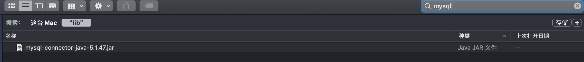
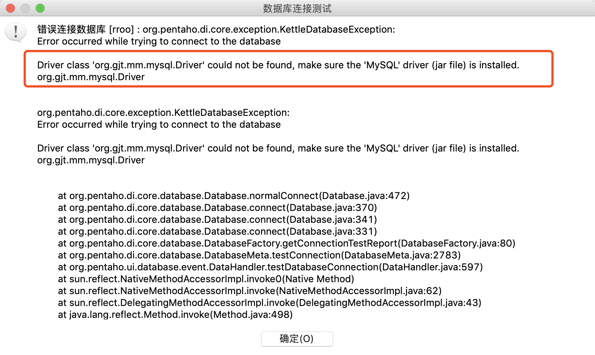
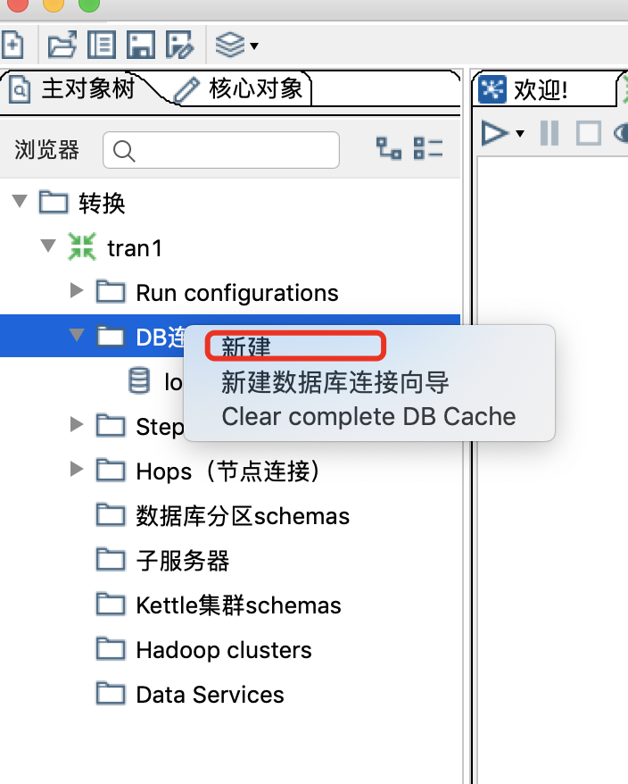

# 数据库连接

> Kettle提供多种数据库的连接，包括常用的关系型数据库、noSql等.

### 数据库驱动
Kettle是通过JDBC连接数据库的，所以跟其他工具连接数据库一样，Kettle也需要首先获取数据库驱动并且将数据库驱动放在Kettle安装目录下的lib目录。

下载的Kettle文件解压后，会解压出一个 ```data-integration``` 目录，lib目录就位于该目录下。Kettle工具解压后的目录详情，
可以参考[工具目录](/quickstart?id=工具目录)，将下载好的数据库驱动包直接放在lib目录下，然后重启Spoon即可。

入下图为Mysql的数据库驱动：



该驱动，存放于Kettle的lib目录下。
如果在lib目录没有对应的数据库驱动，在连接数据库时，会提示以下信息：



Kettle中这类问题提示是非常明显的，遇到此类问题，只需要将对应的数据库驱动放置lib目录然后重启Spoon即可。


### 新建数据库连接

kettle连接数据时，需要在左侧的**主对象树**DB连接处右键 ➡ 新建 ，然后会弹出新建数据库的界面。



根据提示


### 相关文章

- [java 调度 Kettle 时使用 jndi 连接数据库](http://blog.gitor.org/articles/2019/06/29/1561815612401)



