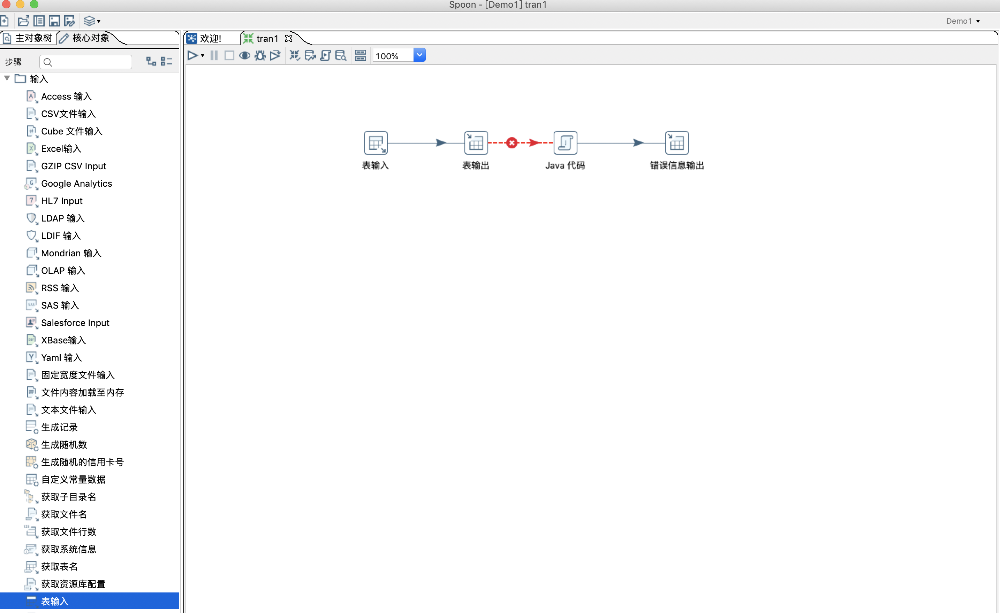
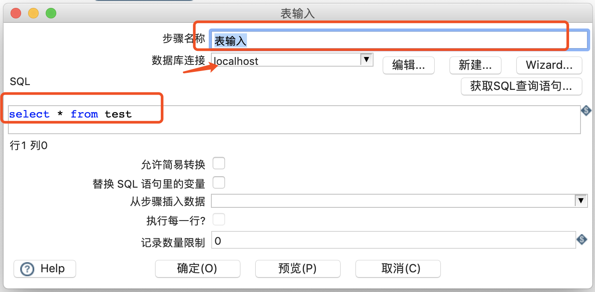
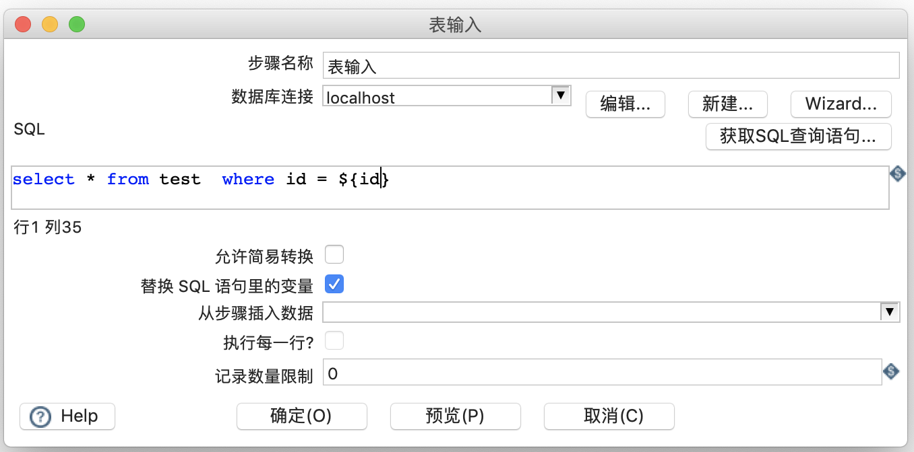

# kettle数据输入

> kettle支持从多种数据源获取数据，除了常用的各种关系型数据库、文本文件、excel等，同时也支持
通过Http接口、WebService等获取需要处理的数据，有些大型的ERP也可以直接对接到Kettle来处理。

### 表输入
> 表输入是Kettle中比较常用的输入方法



在左侧**核心对象** ——> 输入 ——> 表输入，将表输入 用鼠标拖放至右边工作区，即新建了一个表输入组件。



- 步骤名称为自定义的步骤名称，可填写，建议根据业务填写唯一的名称。
- 数据库连接，此处选择一个已经建立的数据库连接，也可以点击后面的**新建**按钮进行新建。
- SQL，查询数据的SQL 语句。
- 在表输入的时候，有一个地方需要说明，就是**替换SQL语句中的变量**，这个功能是比较常用到的，如果勾选了这项，SQL 语句中 ```${name}```这样
的写法，在运行时，会通过名为```name``` 的变量值来替换，否则 SQL语句直接会将 ```${name}``` 当做一个字符串来处理。

如下图，下图中的 ```${id}``` 会被变量值代替，比如在之前定义变量 id = 3 ，那么sql语句在执行时会变成
```select * from test where id = 3```



### 从文本文件

### 从消息队列获取数据

### 从excel获取数据

### 通过Http获取数据

### 通过WebService获取数据

### 获取ERP数据

