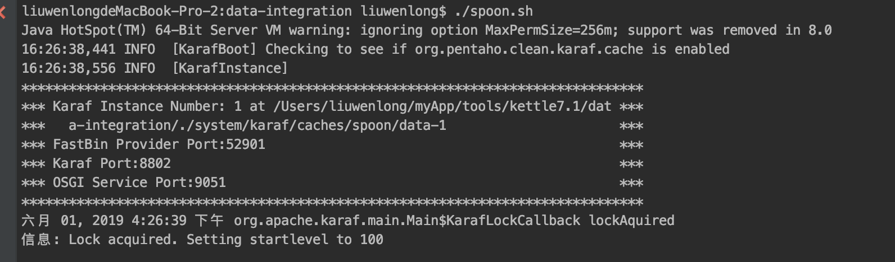
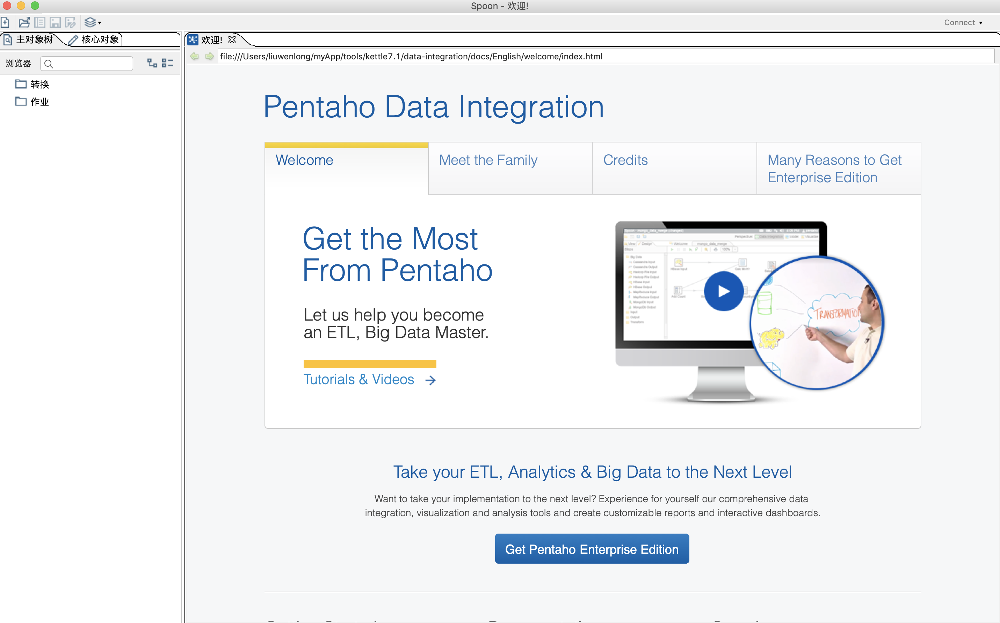

# Kettle spoon基础

### 启动
下载好kettle并解压以后，解压文件里面会有 ```spoon.sh```、```spoon.bat```两个文件。
在Linux和Mac系统下，仅需要在kettle根目录执行```./spoon.sh``` 命令即可启动

控制台打印出如下内容，就是spoon正在启动


在Windows操作系统，则需要双击 ```spoon.bat``` 文件来进行启动

### 界面

spoon启动以后，首先会打开kettle的欢迎界面，如下图所示。

欢迎页会有官方文档链接，英文好的话可以直接查看。


### 资源库
Kettle可以直接以文件的形式存储、运行转换和作业。但是在很多情况下，还是建议采用资源库来管理这些文件。

Kettle有多种形式的资源库，分别为数据资源库、文件资源库、Pentaho资源库，关于资源库可以查看[kettle资源库配置](/spoon/repositorie.md)

### 作业

kettle中，作业是用来控制整个流程的，作业中各子步骤串行
### 转换


