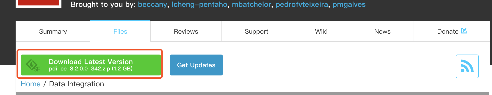
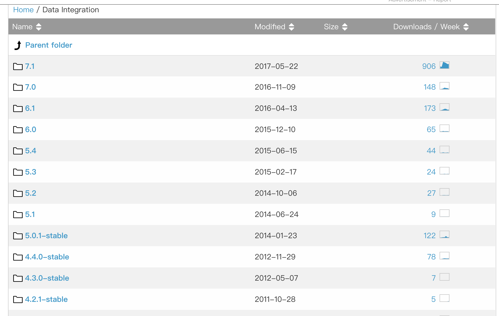

# kettle使用

### 下载
- 可以通过[官网下载地址](https://sourceforge.net/projects/pentaho/files/Data%20Integration/) 下载需要的版本。

- 在官方的下载界面，可以通过点击```Download Latest Version``` 来下载最新版，如下图所示。


- 如果你需要其他的历史版本，也可以在界面上的版本列表中选择需要的版本来下载。


### 工具目录

由于目录文件比较多，这里仅对一、二级目录对内容做简要介绍，其中部分目录文件未做显示。
```
.
├── Carte.bat
├── Data\ Integration.app
│   ├── Contents
│   └── Icon_
├── Data\ Service\ JDBC\ Driver
│   └── pdi-dataservice-driver-bundle-7.1.0.0-12.zip
├── Encr.bat
├── Import.bat
├── Kitchen.bat
├── LICENSE.txt
├── Pan.bat
├── PentahoDataIntegration_OSS_Licenses.html
├── README.txt
├── Spark-app-builder.bat
├── Spoon.bat
├── SpoonConsole.bat
├── SpoonDebug.bat
├── SpoonDebug.sh
├── adaptive-execution
│   ├── bin
│   ├── data
│   ├── deploy
│   ├── etc
│   ├── jaas
│   ├── keytab
│   ├── lib
│   ├── pdi-daemon
│   ├── setenv
│   └── system
├── carte.sh
├── classes
│   ├── kettle-lifecycle-listeners.xml
│   ├── kettle-registry-extensions.xml
│   ├── log4j.xml
│   └── mondrian.properties
├── docs
│   ├── English
│   └── README.txt
├── encr.sh
├── hs_err_pid13093.log
├── hs_err_pid6224.log
├── hs_err_pid6567.log
├── import-rules.xml
├── import.sh
├── kitchen.sh
├── launcher
│   ├── kettle.cfg.xml
│   ├── launcher.properties
│   └── pentaho-application-launcher-7.1.0.0-12.jar
├── lib
│   
├── libswt
│   ├── linux
│   ├── osx64
│   ├── win32
│   └── win64
├── logs
│   └── spoon.log
├── pan.sh
├── plugins
│   ├── VerticaBulkLoader
│   ├── elasticsearch-bulk-insert-plugin
│   ├── elasticsearch-bulk-insert-plugin.zip
│   ├── platform-utils-plugin
│   └── teradata-tpt-bulk-loader
├── purge-utility.bat
├── purge-utility.sh
├── pwd
│   ├── carte-config-8081.xml
│   ├── carte-config-8082.xml
│   ├── carte-config-8083.xml
│   ├── carte-config-8084.xml
│   ├── carte-config-master-8080.xml
│   └── kettle.pwd
├── runSamples.bat
├── runSamples.sh
├── samples
│   ├── db
│   ├── jobs
│   └── transformations
├── set-pentaho-env.bat
├── set-pentaho-env.sh
├── simple-jndi
│   └── jdbc.properties
├── spark-app-builder.sh
├── spoon.command
├── spoon.ico
├── spoon.png
├── spoon.sh
├── system
│   ├── karaf
│   ├── mondrian
│   └── osgi
├── ui
│   ├── browser-toolbar.xul
│   ├── images
│   ├── import-rules-toolbar.xul
│   ├── job-graph.xul
│   ├── job-history-toolbar.xul
│   ├── job-log-toolbar.xul
│   ├── laf.properties
│   ├── main_perspective_overlay.xul
│   ├── menubar.xul
│   ├── spoon.xul
│   ├── trans-grid-toolbar.xul
│   ├── trans-history-toolbar.xul
│   ├── trans-log-toolbar.xul
│   ├── trans-preview-toolbar.xul
│   └── trans-toolbar.xul
└── yarn.sh

```
- 以上为kettle7.1 版本完整的一级目录以及目录下的文件(lib、plugins目录部分文件未显示)，此处选择部分常用的目录/文件进行介绍。
- 目录
    - lib目录，顾名思义，lib目录下存放kettle运行时所需要的依赖库，比如需要连接数据库的JDBC驱动、自己打包的Jar文件等
    - plugins目录，此目录用于存放kettle插件，比如需要连接ES和ES进行数据交换的插件、Kafka消费者插件等，也可以自己开发所需的插件，放置在此目录下。[了解如何开发自定义插件]()
- 文件
    - ```spoon.sh```、```spoon.bat``` 分别用于在不同的系统启动图形化界面，当使用Linux或者Mac系统时，可以执行```spoon.sh```来启动，在Windows操作系统则需要双击```spoon.bat```文件来启动
- 待完善

### 启动
- Windows
- Linux
- Mac

### 源码
kettle目前已经在**Github**上开源，如有需要，可以查看[源码](https://github.com/pentaho/pentaho-kettle)进行学习